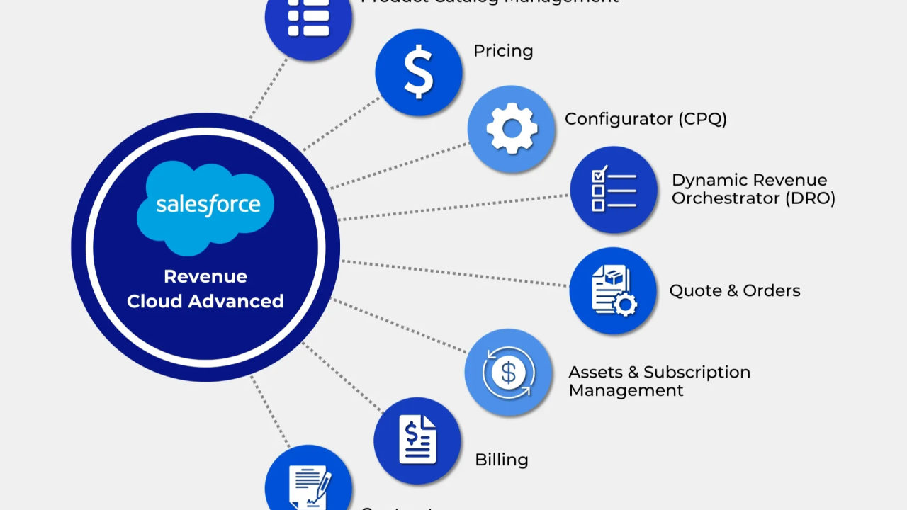

# Salesforce Developer Portfolio 🚀



A modern, high-performance portfolio website built for **Krishna Singh**, a Salesforce Developer specializing in **Revenue Cloud (RCA)**, **CPQ**, and **Agentforce AI** solutions. The portfolio features a sleek "Dark Obsidian & Neon Accents" design, smooth animations, and a fully responsive layout.

---

## ✨ Features

- **Modern UI/UX**: Dark mode aesthetic with neon gradients, glassmorphism, and subtle micro-animations.
- **Fully Responsive**: Optimized for desktop, tablet, and mobile devices using CSS Grid and Flexbox.
- **Project Case Studies**: Dedicated showcase pages for enterprise-scale solutions (e.g., CPQ Automation, Slack/Jira API Bridges).
- **Dynamic SCSS Architecture**: Easily maintainable styling using SCSS variables, mixins, and a modular architecture.
- **Direct PDF Viewer**: Seamlessly opens the embedded Resume PDF without navigating away.
- **Contact Form Integration**: Pre-styled for easy integration with services like Formspree.

## 🛠 Technologies Used

- **HTML5**: Semantic and accessible document structure.
- **SCSS / CSS3**: Advanced styling, custom properties (CSS variables), and keyframe animations.
- **Vanilla JavaScript**: Lightweight interactivity and scroll effects.

## 📂 Project Structure

```text
├── assets/                 # Images, SVGs, and PDF resume
│   ├── jpeg/
│   ├── png/
│   ├── svg/
│   └── pdf/                # Contains resume.pdf
├── css/                    # Compiled CSS files
│   └── style.css
├── sass/                   # SCSS source files
│   └── main.scss
├── index.html              # Main portfolio page
├── project-1.html          # Case study: CPQ Platform
├── project-2.html          # Case study: Slack & Jira Bridge
└── index.js                # Main JavaScript logic
```

## 🚀 Getting Started

To view or modify this project locally, no complex build tools are required:

1. **Clone the repository** (if applicable) or download the files.
2. **Open `index.html`** directly in any modern web browser.
3. _Optional (for SCSS compilation):_ If you wish to edit the styles, install a SASS compiler (like the "Live Sass Compiler" VS Code extension) and set it to watch the `sass/main.scss` file.

## 📬 Contact

- **Name:** Krishna Singh
- **Email:** singhkrishnakks.66@gmail.com
- **LinkedIn:** [Krishna Singh](https://www.linkedin.com/in/krishna-singh-b28b2b136/)
- **GitHub:** [@krishnakks143](https://github.com/krishnakks143)
- **X (Twitter):** [@krishnaakks143](https://x.com/krishnaakks143)

---

_Designed and developed by Krishna Singh. All rights reserved._
